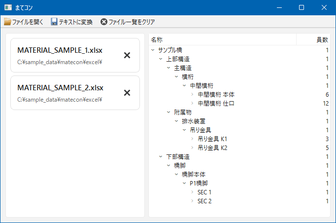

# まてコン：JIP-まてりある用Excel変換ツール

## 機能

- JIP-まてりある（材料計算ソフトウェア）データ作成支援ツールです。
- 材料が計上された Excel ファイルを読み込み、JIP-まてりあるインポートデータ（`*.txt`）を出力します。
- ファイル拡張子 `*.xlsx` または `*.xlsm` の Excel ファイルを読み込みできます。

## Excel テンプレート

材料計上用 Excel ファイルとして、以下のテンプレートを利用できます。

- [material_data_1.xlsx](sample_data/material_data_1.xlsx)

Excel ファイルのシートには以下のヘッダー行が必要です。

<table><tr><td>MARK</td><td>S1</td><td>S2</td><td>S3</td><td>S4</td><td>L</td><td>EACH</td><td>UNITW</td><td>NET</td><td>QUALITY</td><td>REMARK</td><td>COMMENT</td><td>PR1</td><td>PR2</td><td>JV</td><td>ALIAS</td><td>P</td><td>T</td><td>C1</td><td>A1</td><td>C2</td><td>A2</td><td>WT</td><td>WB</td><td>WL</td><td>WR</td><td>YW</td><td>YL</td><td>HT</td><td>FACE1</td><td>FACE2</td><td>BOLT</td><td>PW</td><td>BEND</td><td>LC</td><td>BODY</td><td>WRT</td><td>WRB</td><td>WRL</td><td>WRR</td></tr></table>

## Excel ファイルの注意点

- 各シートにはヘッダー行（MARK, S1, S2, S3, S4, L, ...）が必要です。ヘッダー行以降の行が材料データとして読み込まれます。
- レベル 1 階層 (#1) からの材片データ入力が必要です。
- 上位階層の省略および途中階層の省略はできません。
  - 例: #2 階層のすぐ下に #4 階層が存在するシートの場合、正常に読み込みできません。
- 以下のシートは材料データの変換対象から除外されます。
  1. ヘッダー行が存在しないシート
  2. 非表示のシート
- 材料データは複数シート、複数ファイルに分割可能です。
- 階層名が同一となる階層はマージされます。
